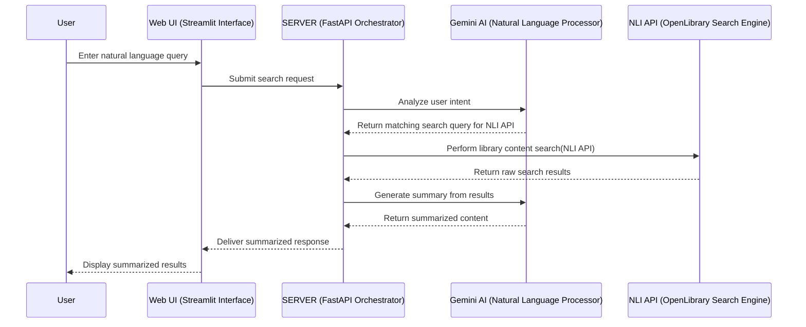

# Discover the **National Library AI Search System**

## Table of Contents

- [Unveiling an AI-Powered Treasure Hunt](#unveiling-an-ai-powered-treasure-hunt)
- [How It Works: A Visual Guide](#how-it-works-a-visual-guide)
- [The Magic Behind **MCP**](#the-magic-behind-mcp)
- [What Can This System Do?](#features)
- [How to start](#usage)

## Unveiling an AI-Powered Treasure Hunt

The **National Library of Israel (NLI)** holds an extensive digital repository, encompassing millions of cultural and historical assets—from ancient manuscripts to contemporary media. While the NLI’s OpenLibrary APIs provide access to this vast collection, their reliance on structured, metadata-focused queries presents a significant hurdle. This complexity often alienates users who lack expertise in library cataloging standards or API syntax, limiting the potential of this valuable resource.

The **National Library AI Search System** transforms this experience by integrating **Google's Gemini AI** to enable natural language search capabilities. Instead of grappling with rigid query formats, users can now explore NLI collections using intuitive phrases such as "medieval Hebrew manuscripts" or "photographs of old Tel Aviv." This system leverages advanced Natural Language Processing (NLP) to interpret queries, construct precise API calls, and deliver relevant results—making the NLI's treasures accessible to a broader audience.

## How It Works: A Visual Guide

The following diagram illustrates the workflow of a query from the user to the final results. The diagram clearly shows the role of each component in the system.



## The Magic Behind **MCP**

Following a deep exploration of Model Context Protocols (MCPs) and understanding their importance, especially in responding to complex APIs, I built this prototype to explain and demonstrate their use and essence. The MCP is essentially the bridge and the messenger: it does not receive the natural language query directly, but rather receives a specific command from the AI model to execute a certain function. After receiving the command, the MCP is the one that sends the queries, receives the information from the API, and passes all the results to the AI which presents the most correct and relevant answer to the user.

I built this prototype for the mentioned needs using the real core of the MCP – **FastAPI** capabilities. These capabilities are powered here by **Google's Gemini AI**. This project serves as an important test for understanding the processes and capabilities required from such a design, and its purpose was to provide this understanding to those exposed to the world of AI development for the first time. Its purpose was also to serve as an intermediate step to create a suitable and worthy MCP project using the insights that emerged.
for more explantion about FASTAPI - [read](https://www.geeksforgeeks.org/python/fastapi-introduction/)

## Features

- **Natural Language Search:** Query the National Library of Israel's API using everyday language.
- **Intelligent Query Analysis:** AI-powered analysis converts natural language into structured API parameters.
- **Multiple Query Execution:** The system can generate and execute multiple targeted searches based on a single complex user query.
- **AI-powered Summarization:** Get concise, AI-generated summaries of search results, including relevant images and direct links.
- **Image and Media Integration:** Retrieve and display images directly from IIIF manifests and provide links to streaming media where available.
- **Multilingual Support:** Supports user interfaces and search queries in both Hebrew and English.
- **Dockerized Environment:** Easy setup and deployment using Docker.

## Technologies Used

- Python
- Streamlit
- FastAPI
- Gemini AI (Google)
- OpenLibrary API

## Usage

Follow these steps to set up and run the **National Library AI Search System** on your local machine.

### What You’ll Need

- Docker Desktop installed on your system.

### 1. Grab Your API Keys

This project requires two API keys:

- Google Gemini API Key: Essential for the AI functionality.
- NLI API Key: For accessing the National Library of Israel's API.

#### How to get your Google Gemini API Key:

- Go to the Google AI Studio website ([here](https://aistudio.google.com/apikey)).
- Sign in with your Google account.
- Click "Get an API Key" or "Create API Key" if you don't have one.
- Copy the generated API key.

#### How to get your NLI API Key:

- The docker-compose.yml file includes a default visitor key, which allows basic access to the library data. Obtaining a personal API key is not essential for the project's initial function. However, if you want to get full access to all the data and capabilities the National Library offers, it is highly recommended to register and get your own API key.
- Visit the National Library of Israel's Open Library API documentation Open Library API ([click](https://api2.nli.org.il/signup/)).
- Follow the instructions to register and get your API key. You may need to contact the National Library for access.

### 2. Set Up the Project

Clone the Repository:

```bash
git clone <repository_url>
cd <repository_name>
```

(Replace <repository_url> with the actual URL of your repository and <repository_name> with the folder name.)

Configure the API Keys:

- Open the docker-compose.yml file in your project folder.
- Locate the environment section under myservice:

```yaml
environment:
  - GEMINI_API_KEY=your_key # replace with your actual Gemini API key
  - NLI_API_KEY=DVQyidFLOAjp12ib92pNJPmflmB5IessOq1CJQDK
```

- Replace your_key with your actual Google Gemini API key.
- (Optional, but recommended for full access) Replace the default NLI_API_KEY with your own NLI API key.

### 3. Launch the System with Docker

Navigate to your project's root folder (where docker-compose.yml is located) in your terminal and run:

```bash
docker-compose up --build
```

This command will:

- Build the Docker image based on the Dockerfile.
- Create and run the myservice container, which runs both the FastAPI backend and the Streamlit frontend.
- Map port 8000 (FastAPI) and port 8501 (Streamlit) from the container to your host machine.

### 4. Explore the Application

Once the Docker containers are up and running, you can access the Streamlit web interface in your browser:

- Streamlit Frontend: http://localhost:8501

You can also access the **FastAPI** documentation (Swagger UI) at:

- **FastAPI** Backend (Documentation): http://localhost:8000/docs

## How to Use Your New Search Tool

- Open your web browser and navigate to http://localhost:8501.
- Select your preferred language (Hebrew or English) from the sidebar.
- Type your natural language query into the search box (e.g., "ספרים של ביאליק שיצאו לאור אחרי 1920" or "Books by Bialik published after 1920").
- Click the "Search" button.
- The system will analyze your query, search the National Library, and provide a summary of the results, including images and links.

## Directory Structure

| File Name           | Description                                                                                                       |
| ------------------- | ----------------------------------------------------------------------------------------------------------------- |
| docker-compose.yml  | Defines the Docker services, networks, and volumes for the project.                                               |
| Dockerfile          | Instructions for building the Docker image for the application.                                                   |
| mcp_tool.py         | Contains the FastAPI application, which handles the API integrations with the National Library and Google Gemini. |
| ui.py               | The Streamlit application that provides the user interface.                                                       |
| openapi_schema.json | An OpenAPI specification for the FastAPI routes, used by the Streamlit app to understand available parameters.    |
| start.sh            | A shell script to run FastAPI and Streamlit concurrently inside the Docker container.                             |

## Join the Project

Contributions are welcome! If you have suggestions for improvements, bug fixes, or new features, feel free to open an issue or submit a pull request.

## License

This project is open-source and available under the MIT License.
Users must retain the copyright notice and license text in all copies or substantial portions of the software.

